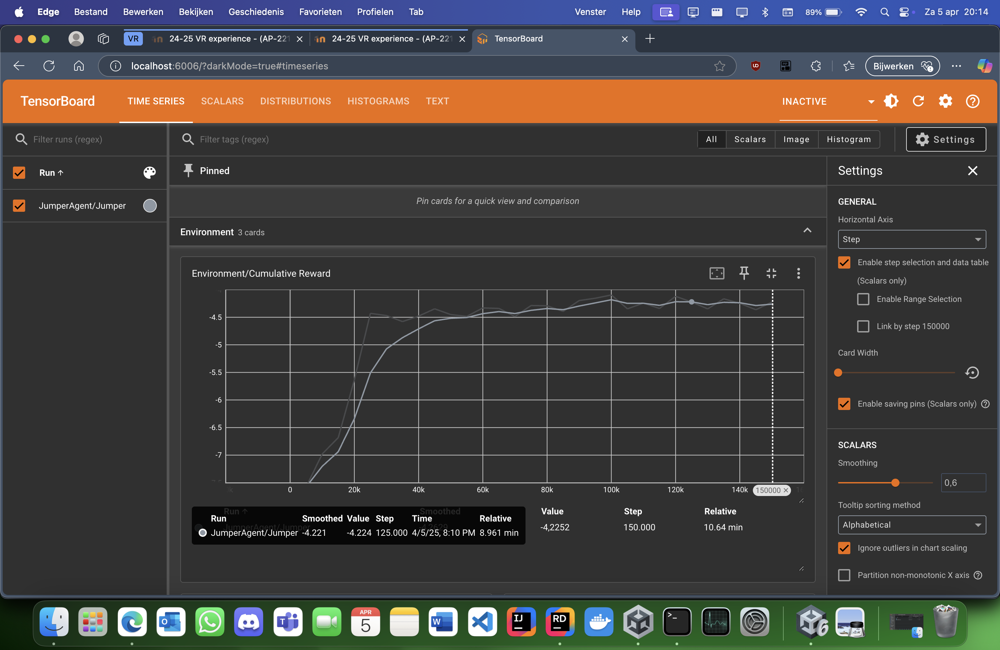
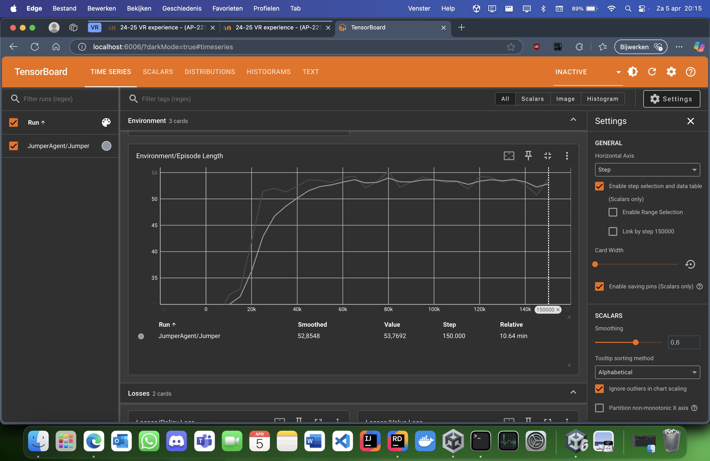

Jumper
======

Beschrijving
------------

**Jumper** is een eenvoudige 2D-omgeving waarin een agent leert om over obstakels te springen. De agent staat op een platform en wordt geconfronteerd met een rij bewegende obstakels. De agent moet leren om op het juiste moment te springen om obstakels te ontwijken en zo lang mogelijk te overleven. De omgeving is ontworpen om de agent te trainen in het timen van sprongen en het vermijden van botsingen, met een beloningsstructuur die reward hacking (constant springen) voorkomt.

### Doel

Het doel van de agent is om:

-   Obstakels te ontwijken door erover te springen.
-   Onnodige sprongen te vermijden om energie te sparen.
-   Zo lang mogelijk te overleven door botsingen met obstakels te vermijden.

### Beloningen

-   Goed getimede sprong: +0.15 tot +0.3 beloning, afhankelijk van de timing ten opzichte van het dichtstbijzijnde obstakel.
-   Onnodige sprong: -0.4 straf.
-   Consecutieve sprongen: -0.1 * aantal consecutieve sprongen (straf om spammen te ontmoedigen).
-   Niet springen wanneer nodig: -0.3 straf als een obstakel te dichtbij is.
-   Obstakel ontwijken: +3.0 beloning wanneer een obstakel de agent passeert zonder botsing.
-   Obstakel raken: -6.0 straf bij botsing met een obstakel (einde episode).
-   Overleving: +0.01 beloning per frame om de agent aan te moedigen langer te overleven.
-   Stapstraf: -0.01 straf per beslissingsstap om de agent te stimuleren efficiënt te handelen.

### Acties

De agent heeft een discrete actieruimte met twee mogelijke acties:

-   0: Niets doen.
-   1: Springen.

### Waarnemingen

De agent observeert de volgende informatie:

-   Positie van de agent (x, y).
-   Snelheid van de agent (x, y).
-   Positie van het dichtstbijzijnde obstakel (x, y).
-   Snelheid van het dichtstbijzijnde obstakel (x, y).
-   Of de agent op de grond staat (isGrounded).
-   Huidig energieniveau van de agent.
-   Aantal consecutieve sprongen.

Totaal: 11 waarnemingen (vector observatie grootte = 11).

Installatie en Gebruik
----------------------

### Vereisten

-   Unity: Versie 2022.3 of hoger (getest met Unity 6).
-   ML-Agents: Unity ML-Agents pakket (versie 2.0 of hoger).
-   Python: Python 3.8 of hoger.
-   ML-Agents Python pakket: ml-agents (versie 0.30.0 of hoger).

### Installatie

1.  Kloon de repository: git clone <https://classroom.github.com/a/nZ61_guv> cd <repository-naam>
2.  Open het project in Unity:
    -   Open Unity Hub.
    -   Klik op "Add" en selecteer de gekloonde repository map.
    -   Open het project met Unity 2022.3 of hoger.
    -   In Unity, open de scène Assets/Scenes/JumperScene.unity.
3.  Installeer ML-Agents Python pakket:
    -   Zorg ervoor dat Python 3.8+ is geïnstalleerd.
    -   Installeer het ml-agents pakket: pip install mlagents

### De Agent Testen (Heuristic Mode)

1.  Open de JumperScene in Unity.
2.  Selecteer de JumperAgent GameObject in de Hierarchy.
3.  In de Inspector, onder Behavior Parameters, stel Behavior Type in op Heuristic Only.
4.  Druk op Play in Unity.
5.  Gebruik de spatiebalk (Space) om de agent te laten springen en obstakels te ontwijken.

### De Agent Trainen

1.  Zorg ervoor dat de Behavior Type van de JumperAgent is ingesteld op Default.
2.  Open een terminal in de projectmap.
3.  Start de training met het meegeleverde configuratiebestand: mlagents-learn config/jumper.yaml --run-id=JumperTraining --force
4.  Druk op Play in Unity om de training te starten.
5.  De training loopt voor 150.000 stappen (zoals ingesteld in jumper.yaml).

### Trainingsresultaten Bekijken

1.  Open TensorBoard om de trainingsresultaten te bekijken: tensorboard --logdir results
2.  Open je browser en ga naar http://localhost:6006.
3.  Bekijk de grafieken onder Scalars, zoals Environment/Cumulative Reward en Environment/Episode Length.

Trainingsresultaten
-------------------

De JumperAgent werd getraind gedurende 150.000 stappen met behulp van het PPO-algoritme. De uiteindelijke gladgestreken cumulatieve beloning (met smoothing ingesteld op 0.6) was -4.224. Dit geeft aan dat de agent nog aan het leren is om obstakels effectief te ontwijken, maar dat de beloningsstructuur succesvol reward hacking (constant springen) heeft voorkomen.

### Cumulatieve Beloning

### Episode Lengte

Bronnen
-------

-   [ML-Agents Documentatie](https://github.com/Unity-Technologies/ml-agents/blob/develop/docs/Learning-Environment-Examples.md)
-  [Unity Documentatie](https://docs.unity3d.com/Manual/index.html)